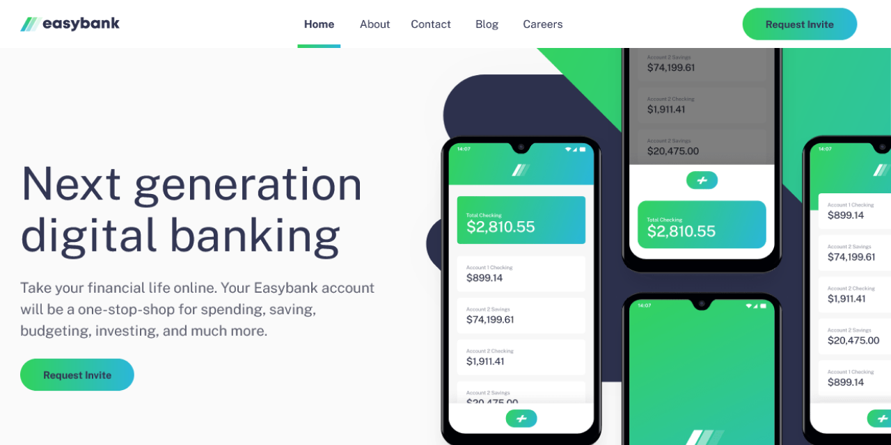

# Frontend Mentor - Easybank landing page solution

This is a solution to the [Easybank landing page challenge on Frontend Mentor](https://www.frontendmentor.io/challenges/easybank-landing-page-WaUhkoDN). Frontend Mentor challenges help you improve your coding skills by building realistic projects. 

## Table of contents

- [Overview](#overview)
  - [The challenge](#the-challenge)
  - [Extra challenges](#extra-challenges)
  - [Screenshot](#screenshot)
  - [Links](#links)
- [My process](#my-process)
  - [Built with](#built-with)
  - [What I learned](#what-i-learned)
  - [Continued development](#continued-development)
  - [Useful resources](#useful-resources)
- [Author](#author)

## Overview

### The challenge

Users should be able to:

- View the optimal layout for the site depending on their device's screen size.
- See hover states for all interactive elements on the page.

### Extra challenges

As a bonus I want to achieve the following extra challenges:

- The page must be accessible according to WCAG 2.1 standards, things like color contrast, skip links, clear element focus, keyboard navigation support and necessary aria attributes.
- I want to add minimal animations to the page, such as a toggle animation on the responsive menu and transforms on various content on the page using the IntersectionObserver.

### Screenshot



### Links

- Solution URL: [Add solution URL here](https://your-solution-url.com)
- Live Site URL: [Add live site URL here](https://your-live-site-url.com)

## My process

### Built with

- Semantic HTML5 markup
- CSS custom properties
- Flexbox
- CSS Grid
- Mobile-first workflow
- WCAG 2.1 best practices
- [Astro](https://astro.build) - Astro Static Site Generator
- [Accessible Astro Starter](https://github.com/markteekman/accessible-astro-starter) - My own starter template for Astro

### What I learned

I learned how to add a transition to background gradients.The `background` CSS property can not be transitioned by default. A solution I found online is where you add the hover effect on the before pseudo element and use the transition on the opacity property:

```scss
.call-to-action {
  background: linear-gradient(to right, var(--primary-clr-200), var(--primary-clr-300));
  position: relative;
  z-index: 1;
  // other styles
}

.call-to-action::before {
  position: absolute;
  content: "";
  top: 0;
  right: 0;
  bottom: 0;
  left: 0;
  border-radius: 2em;
  background: var(--primary-clr-100);
  z-index: -1;
  transition: opacity 0.25s ease-in-out;
  opacity: 0;
}

.call-to-action:hover::before,
.call-to-action:focus::before {
  opacity: 1;
}
```

### Continued development

- What I found difficult was how to properly size the Hero background SVG and the mockup images for responsive sizes. I used a lot of breakpoints to resize them for a lot of different screen widths. I can't imagine this being the best solution, because it's a very tedious and error prone approach. I want to learn more on creating such sections in a more elegant way and I'm hoping to learn that by looking at the solutions of others.

### Useful resources

- [Background gradient transition](https://keithjgrant.com/posts/2017/07/transitioning-gradients/) - This is the example I used to create the transition on the button.

## Author

- [Personal Website](https://www.markteekman.nl)
- [Frontend Mentor Profile](https://www.frontendmentor.io/profile/markteekman)
- [LinkedIn Page](https://nl.linkedin.com/in/markteekman)
- [GitHub Projects](https://nl.linkedin.com/in/markteekman)
- [NPM Packages](https://www.npmjs.com/~markteekman)
- [CodePen Creations](https://codepen.io/markteekman)
